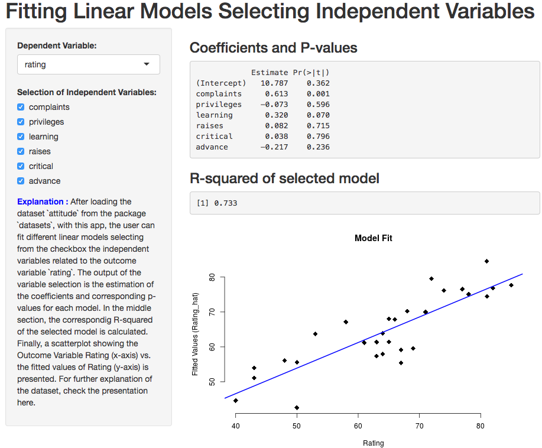

```{r setup, include=FALSE}
knitr::opts_chunk$set(echo = FALSE)
```

## Dataset used

From the package `datasets`, we selected the set ``attitude`. According to the description file, the `attitude` dataset comes from a survey of the employees of a large financial organization, the data are aggregated from the questionnaires of the approximately 35 employees for each of 30 (randomly selected) departments. The numbers give the percent proportion of favourable responses to seven questions in each department.

- `rating` =	Overall rating (outcome variable)
- `complaints`	=	Handling of employee complaints
- `privileges` =	Does not allow special privileges
- `learning`	=	Opportunity to learn
- `raises` =	Raises based on performance
- `critical`	=	Too critical
- `advance`	=	Advancement

## Application functionality
The user can fit different linear models selecting from the checkbox the independent variables related to the outcome variable `rating`. The output of the variable selection is the estimation of the coefficients and corresponding p-values for each model. In the middle section, the correspondig R-squared of the selected model is calculated. Finally, a scatterplot showing the Outcome Variable Rating (x-axis) vs. the fitted values of Rating (y-axis) is presented.


The app can be found in [davlira82.shinyapps.io/shinyappcourseproject/](https://davlira82.shinyapps.io/shinyappcourseproject/).

Click [here](https://github.com/davlira82/shinyapp) to visit the github repo for the project.

## Some code included in the app
From the server.R file, we see the code to produce the plot included in the app.

``` {r, eval=FALSE, echo=TRUE}
  output$plot <- renderPlot({
    plot(dat[,1], lm1()$fitted.values, xlab = "Rating",
         ylab = "Fitted Values (Rating_hat)", main = "Model Fit",
         cex = 1.5, pch = 18, bty = "n")
    if(!is.null(lm1())){
      abline(lm(lm1()$fitted.values ~ dat[,1], data=dat) , 
             col = "blue", lwd = 2)
    }
  })
```

## Look at the app


